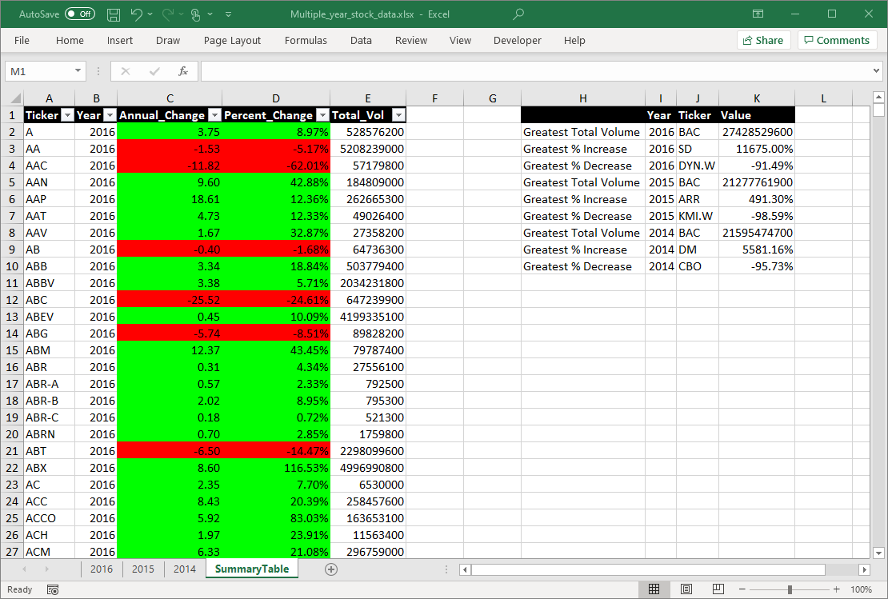
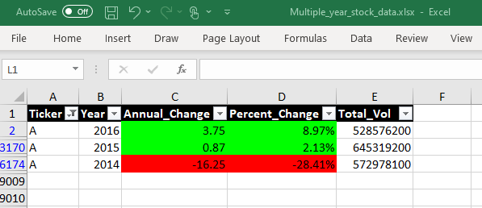
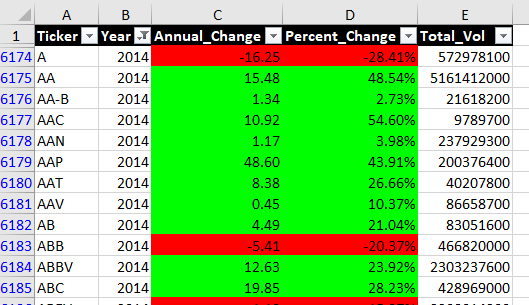
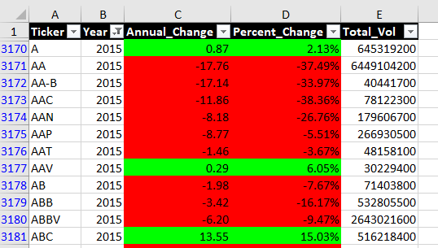
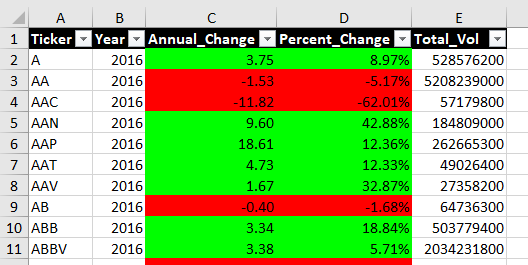

# Assignment 2: VBA Scripting

## Files
| File     | Description | Source |
|:---------|:------------|:-------|
Multiple_year_stock_data.xlsx | Full data containing multiple years of stock data | Course Repository
[Analyzer.bas](Analyzer.bas) | VBA module for summarizing the stock data | This Repository

## Walkthrough
1. Download the file **Multiple_year_stock_data.xlsx** from the course repository
2. Download the module file [Analyzer.bas](Analyzer.bas)
3. Import the **Analyzer.bas** vba module into the Excel Workbook
4. Run the **Main** macro

## Output
The VBA script will read through each Worksheet in the Workbook and then create the "SummaryTable" worksheet which contains the summary data for each stock and provides the top performers metrics.

Example: Filter the summary data by stock ticker to see each year's summary:

Example: Filter the summary data by year to see a summary of each stock in the given year:

