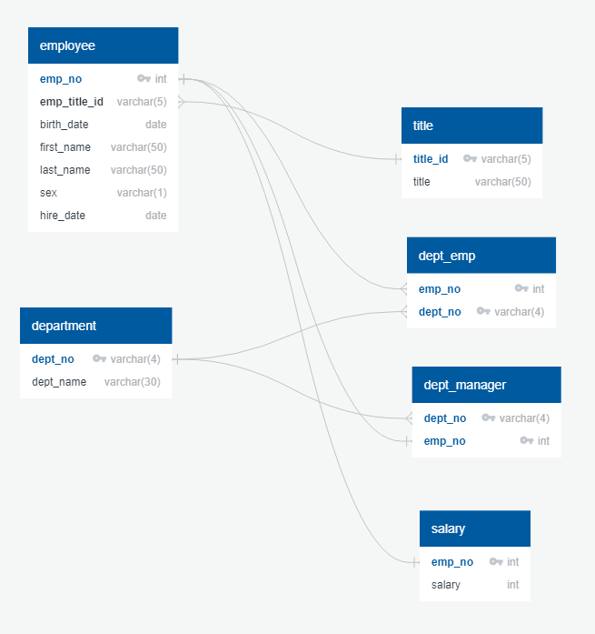
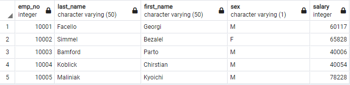
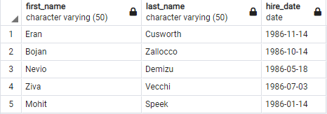
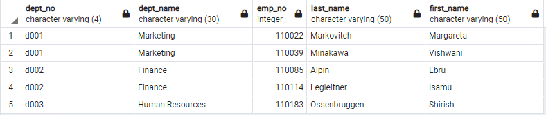
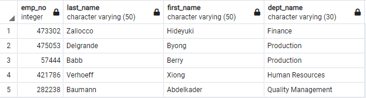
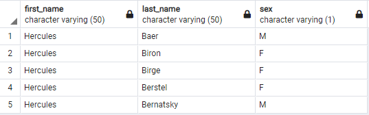
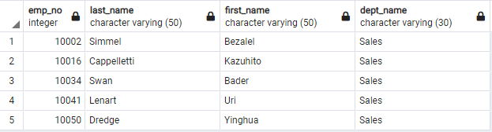
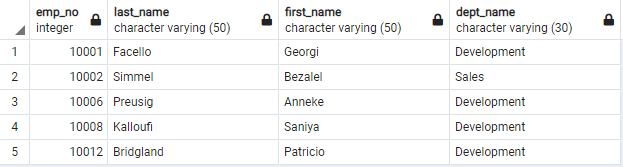
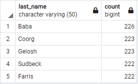

# Assignment 9: SQL

## Files
| File     | Description | Source |
|:---------|:------------|:-------|
[schema.sql](schema.sql) | SQL statements to generate the database tables | This Repository
[query.sql](query.sql) | Collection of SQL queries for the data analysis | This Repository

** The CSV files referenced below containing the sample data used in this assignment may be obtained from the course repository.

## Getting Started
1. In the local instance on PostgreSQL create a database called `employees_db`:
```sql
DROP DATABASE IF EXISTS employees_db;
CREATE DATABASE employees_db;
```
2. Create the tables using [schema.sql](schema.sql).
3. Import each csv data file to the appropriate table in the following order:

| Order | Source File | Table |
|:-----:|:------------|:------|
1 | departments.csv | department |
2 | titles.csv | title |
3 | employees.csv | employee |
4 | dept_emp.csv | dept_emp |
5 | dept_managers.csv | dept_manager
6 | salaries.csv | salary

### Entity Relationship Diagram


## Walkthrough
1. Open the [query.sql](query.sql) file in the query editor.
2. Execute each query by highlighting the query and running the statement.
 
## Output
List the following details of each employee: employee number, last name, first name, sex, and salary.



List first name, last name, and hire date for employees who were hired in 1986.



List the manager of each department with the following information: department number, department name, the manager's employee number, last name, first name.



List the department of each employee with the following information: employee number, last name, first name, and department name.



List first name, last name, and sex for employees whose first name is "Hercules" and last names begin with "B".



List all employees in the Sales department, including their employee number, last name, first name, and department name.



List all employees in the Sales and Development departments, including their employee number, last name, first name, and department name.



In descending order, list the frequency count of employee last names, i.e., how many employees share each last name.


