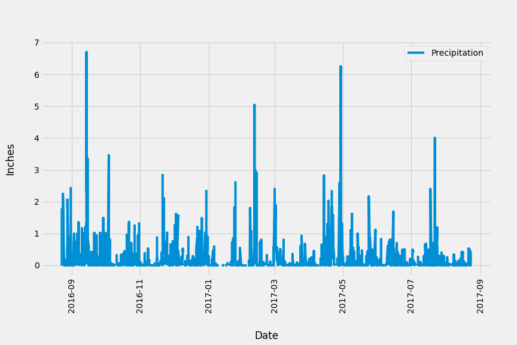
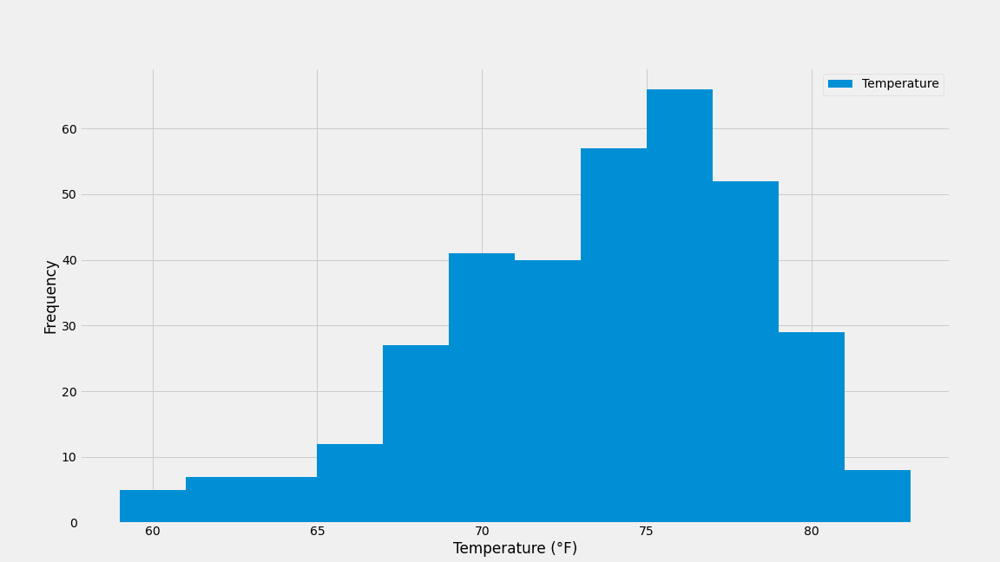

# Assignment 10: SQLAlchemy

## Files
| File     | Description |
|:---------|:------------|
[app.py](app.py) | Flask app script file
[climate.ipynb](climate.ipynb) | Juypter notebook for climate analysis


## Getting Started
### Install required modules
1. Install flask-sqlalchemy module
    ```
    pip3 install flask-sqlalchemy
    ```

## Walkthrough
1. Start up the flask app using the [app.py](app.py) script.
```
python .\app.py
```
2. In the browser, navigate to the newly started web server.
3. Use the available API endpoints to query for additional weather data

## Output
The climate analysis contains two charts:

Line chart of precipitation over time


Histogram of Station data
