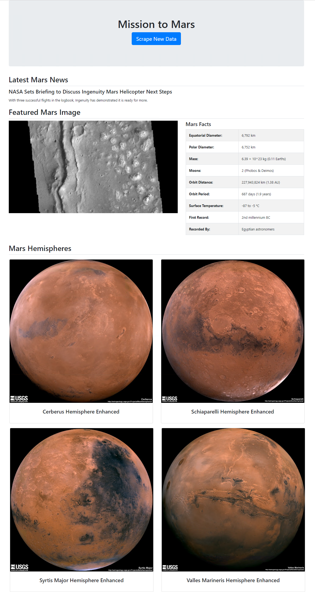

# Assignment 12: Web Scraping

## Files
| File     | Description |
|:---------|:------------|
[app.py](app.py) | Flask app script file
[scrape_mars.py](scrape_mars.py) | Python script version of web scraping code
[index.html](templates/index.html) | HTML template file used by Flask
[mission_to_mars.ipynb](mission_to_mars.ipynb) | Juypter notebook for web scraping code


## Getting Started
### Import required modules
1. Install flask_pymongo module
```
pip3 install flask_pymongo
```
2. Install splinter module
```
pip3 install splinter
```
3. Install webdriver_manager module
```
pip3 install webdriver_manager
```
### Other Dependencies
* Google Chrome is the browser used by the script files. If using a different browser the scripts will need to be modified to import the appropriate web driver.
* MongoDB


## Walkthrough
1. Start up the flask app using the [app.py](app.py) script.
```
python .\app.py
```
2. In the browser, navigate to the newly started web server.
3. Click the "Scrape New Data" button to invoke web scraping and load the latest data.


## Output
After web scraping occurs the rendered page should like similar to:

