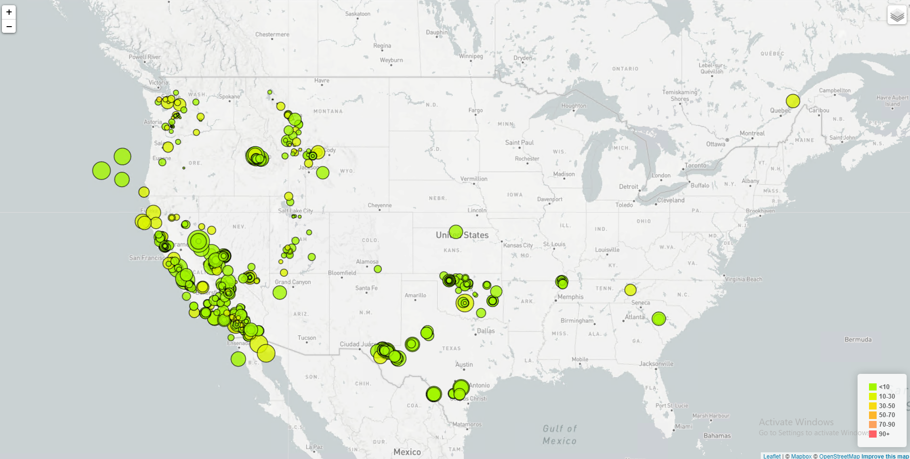

# Assignment 17: Mapping-Web (Leaflet.js / D3.js)

## Getting Started

### Add mapbox.com API Key to [config.js](static/js/config.js)
```javascript
const API_KEY = "INSERT_YOUR_API_KEY";
```

## Walkthrough
1. In your terminal, navigate to the directory that contains index.html
1. Startup a python web server
    ```python
    python -m http.server
    ```
1. In the browser, navigate to the running local web server. It should be similar to `http://localhost:8000`

## Output
A map rendering will appear that contains earthquake data based on magnitude and coloration by depth. It should appear similar to:
